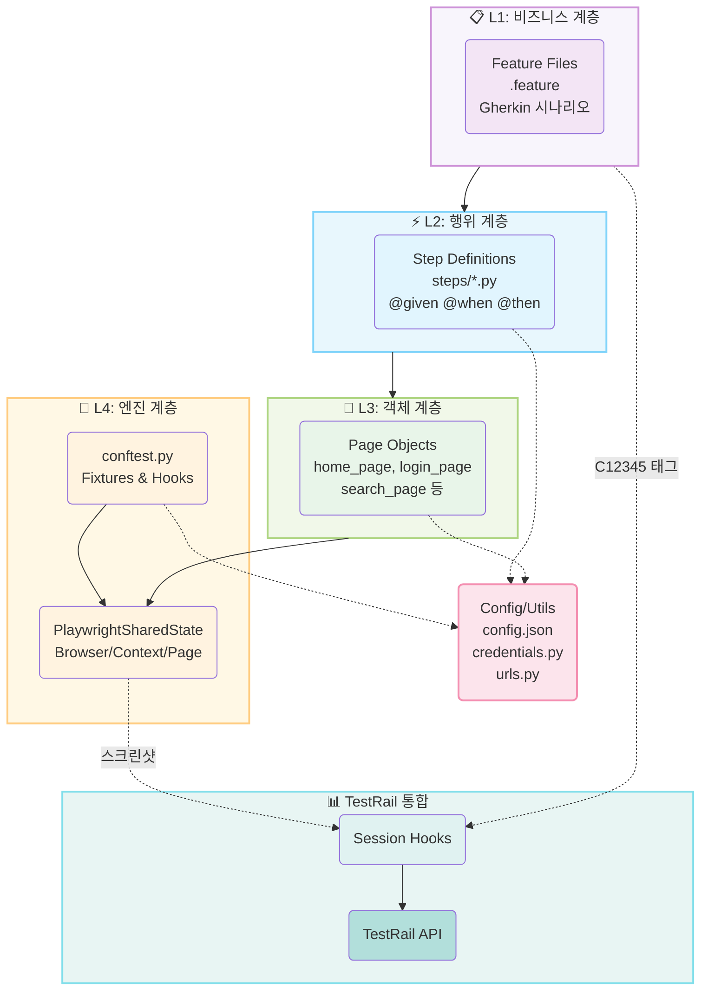
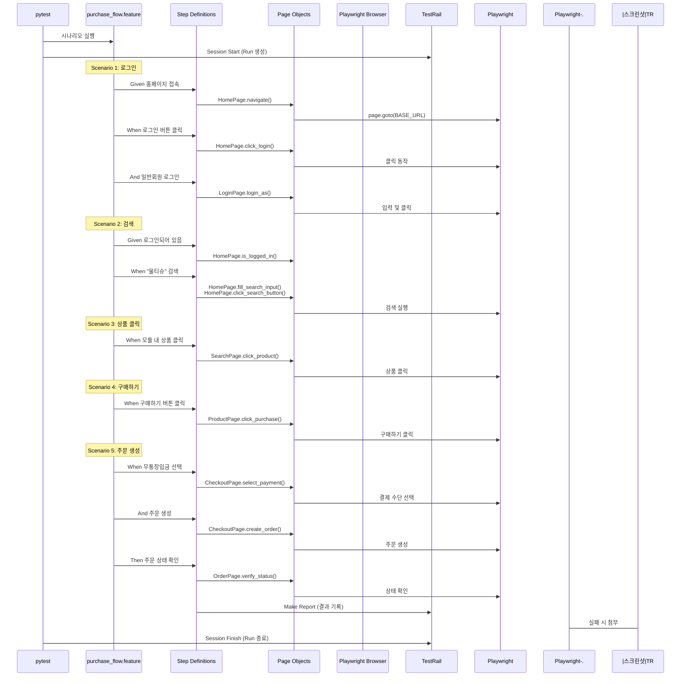
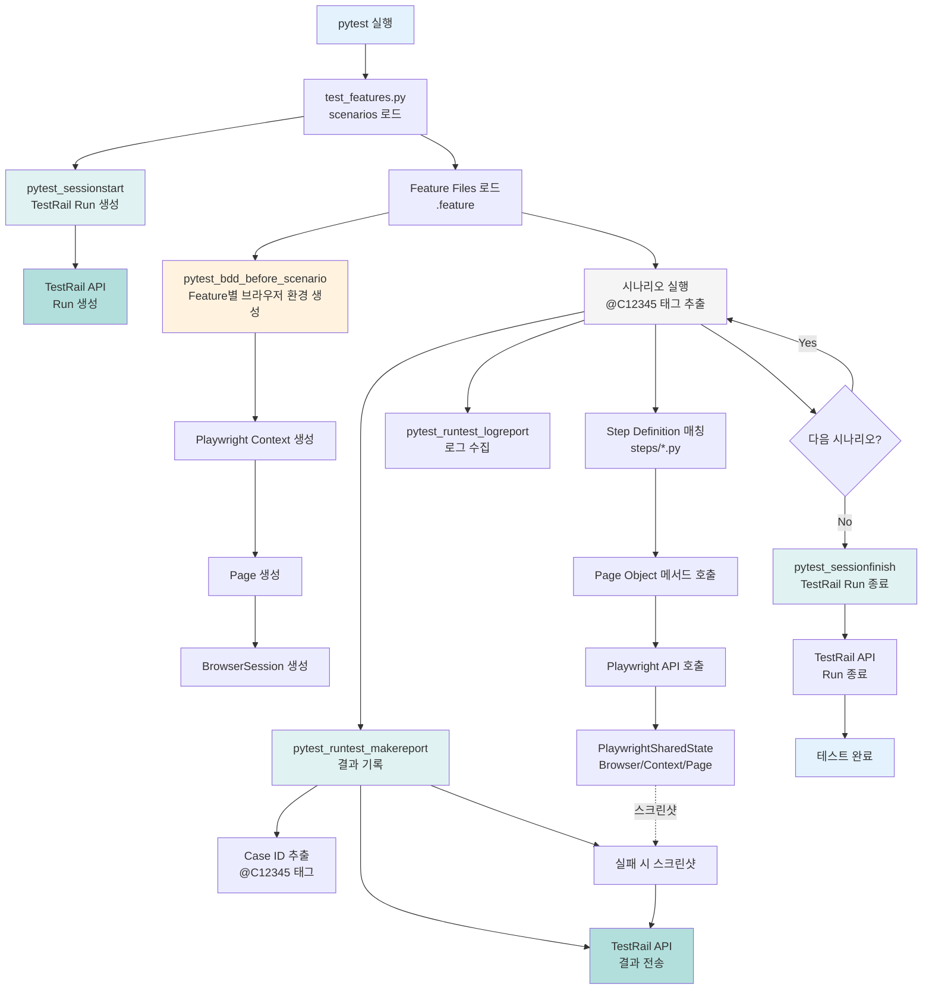
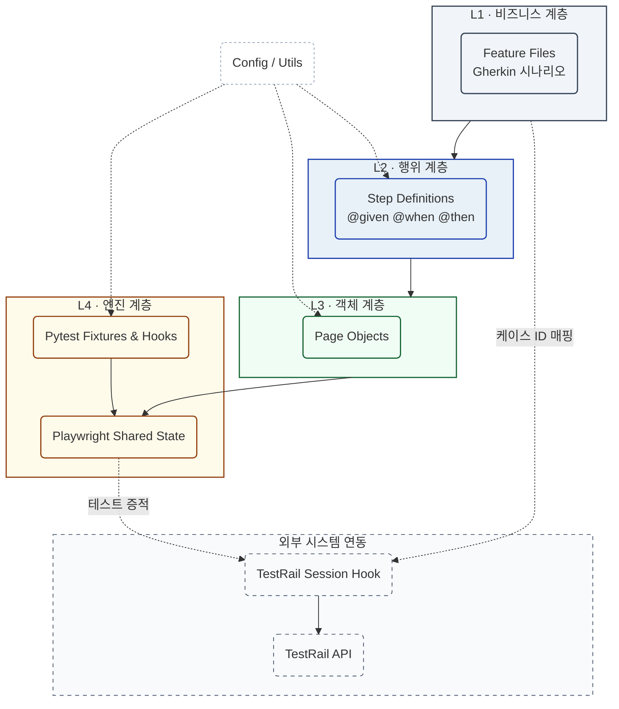

# G마켓 자동화 테스트 프로젝트 - 플로우 다이어그램

Mermaid Live Editor (https://mermaid.live)에서 사용할 수 있는 다이어그램 코드입니다.

**⚠️ 중요: Mermaid Live Editor에 붙여넣을 때는 아래 각 코드 블록의 내용만 복사하세요!**
- ```mermaid 와 ``` 사이의 코드만 복사
- 마크다운 형식(---, ## 등)은 제외

---

## 1. 프로젝트 아키텍처 다이어그램



---

## 2. 구매 플로우 시퀀스 다이어그램



---

## 3. 전체 테스트 실행 플로우



---

## 4. 컴포넌트 간 의존성 다이어그램



---

## 사용 방법

### ⚠️ 중요 사항
**Mermaid Live Editor에는 순수한 Mermaid 코드만 입력해야 합니다!**
- 파일 전체를 복사하지 마세요
- 각 다이어그램의 ```mermaid 와 ``` 사이의 코드만 복사하세요
- 마크다운 형식(---, ##, ``` 등)은 복사하지 마세요

### 단계별 사용법

1. **Mermaid Live Editor 접속**: https://mermaid.live
2. **코드 블록 열기**: 위에서 원하는 다이어그램의 ```mermaid 시작 부분 찾기
3. **코드 복사**: ```mermaid부터 다음 ```까지의 코드만 복사
   - 예: ```mermaid 다음 줄부터 시작
   - ``` 전 줄까지 복사
4. **붙여넣기**: Mermaid Live Editor의 왼쪽 편집창에 붙여넣기
5. **확인**: 오른쪽에서 다이어그램이 올바르게 렌더링되는지 확인

각 다이어그램은 독립적으로 사용할 수 있습니다.

